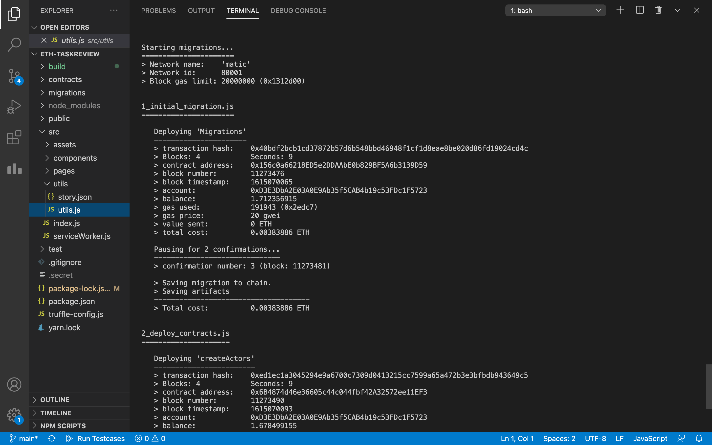

# TaskReview

### totally transparent and permanent blockchain solution for task review and record safekeeping.

our webapp tries to break the barriers of social inequality in companies due to biases and stereotypes by acting as evidence of work for each and every employee.

The special property of blockchain deployed smart contracts that they are not changable once a transaction has been made is used here to create records of every task done by an employee.

every task can be boosted by upto 5 people thus supporting the quality of work in that particular task.

&nbsp;

# Use Cases:

1. Can be used as a record keeping application for company tasks for future referencing and management purposes.

2. Can act as evidence in court cases between employee and company due to the special property of being tamper proof.

3. publically viewable blockchain promotes full transparency.

&nbsp;

&nbsp;

&nbsp;

### truffle migrations and contract deployment

&nbsp;

&nbsp;

&nbsp;

&nbsp;

&nbsp;

&nbsp;

### FrontEnd of Project

&nbsp;

&nbsp;

